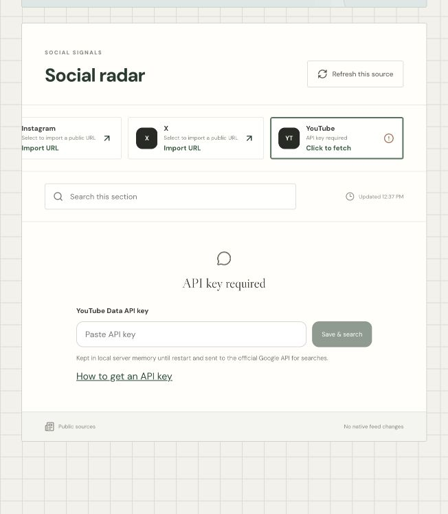
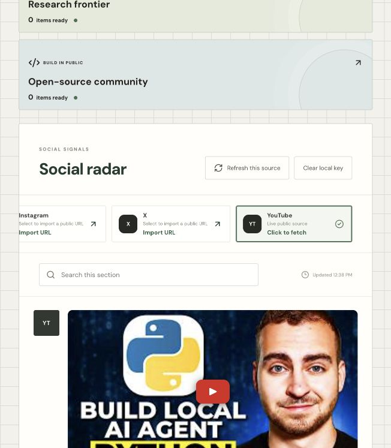
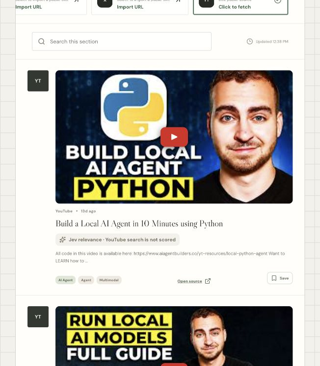

# Feed Gardener

Feed Gardener is a local-first discovery and read-later workspace that helps you build a feed around your own interests. It collects public content from multiple sources, applies your explicit filters, and uses optional Jev title scoring to shape the feed you asked for.

The current local interface still uses the name Feeder in its browser title.

Your interests and feedback belong to Feed Gardener. The app does not train or modify another platform's recommendation system.

## What it does

- **Discover across sources.** Fetch public candidates from arXiv, GitHub, Hacker News, Bilibili, and configured YouTube search. Bilibili searches English and Chinese interest labels together and displays video cards.
- **Control relevance.** Choose a minimum Jev score from 1 to 10. Every displayed item must meet that score with at least 70% confidence, including Bilibili and YouTube. Pending or unavailable scores stay hidden; fewer matches never lower the threshold.
- **Set hard boundaries.** Selected interests guide discovery; blocked topics and sources stay excluded.
- **Understand each recommendation.** Every item can explain which interests, source, and freshness signals placed it in the feed.
- **Keep and refine.** Save items for later, hide them, mark them as not interesting, and undo feedback. These actions affect only your Feed Gardener experience.
- **Manage a local library.** Save discovered items or any HTTP(S) link with a type, note, and reading status.

## How it works

```text
Choose interests and exclusions
        ↓
Fetch public candidates on demand
        ↓
Normalize, deduplicate, and apply hard filters
        ↓
Rank the eligible titles and build the requested feed
        ↓
Open, save, hide, or reject items to refine the next feed
```

Jev scores title relevance only. A score is not proof that the full content is relevant or high quality. Feed Gardener shows missing scores, low confidence, source failures, and insufficient candidates instead of inventing results.

## Run locally

Requirements: Node.js 22.13 or newer and pnpm 11.19.

```sh
pnpm install --frozen-lockfile
pnpm dev
```

Open [http://127.0.0.1:3000](http://127.0.0.1:3000). You can also double-click `Launch.command` on macOS or `Launch.bat` on Windows. These launchers install missing dependencies, build the current app, start the local server, and open the page. Keep the launcher window open while using Feeder.

The app opens directly in the workspace. Use **Discover → Manage interests** to choose areas or specific tags, or enter your own tag. Area selections are used for search and nearby topics until you add specific tags. **Discover → Sources → Bilibili** fetches videos for the saved interests; **My garden → Nearby topics** shows related suggestions.

The core local experience works without an account or database. Optional Jev, YouTube Search, and read-only YouTube connection settings are documented in [`.env.example`](.env.example).

## Historical onboarding walkthrough

These screenshots record the earlier landing flow from September 23, 2026. The landing page source remains in the repository for future account onboarding, but the current app opens directly in the workspace. The screenshots below are historical examples; use **Discover → Manage interests** for the current flow. Public items and Jev scores can change between runs.

1. **Start the local app and enter setup.** Run `pnpm dev` in this repository, then visit `http://localhost:3000`. On a new profile, the welcome screen explains that you are building your own feed. Click **Let's find your world** to open the interest picker. This button only advances setup: it does not select tags or fetch any content.

   

2. **Find the right interest area.** The world picker groups topics under broad areas such as Technology, Music, and Sports. Click **Technology** to reveal narrower groups, including **AI infrastructure** and **Developer tools**. Opening an area is navigation only; it does not select every topic in that area. Use the search field if the area you want is not visible.

   

   

3. **Pick the topics that should guide the feed.** Expand **AI infrastructure** and select **Local inference** and **Agents** individually. A check mark appears on each selected card, and the footer changes to **2 interests picked**. The group-level **Select all** control would pick every topic in the group, which is broader than this example. These two selected tags become your saved interests and later help Feed Gardener request and match public items. Click **Next: less of this** when the count and check marks are correct.

   

4. **Exclude an unwanted topic.** This screen is optional and has the opposite purpose from step 3: it blocks matching content. Type **Gaming** in the search box to find related topics, then select **Game reviews**. Confirm that the excluded-topic count in the footer changes to **1**, and click **Enter my feed**. Feed Gardener saves the wanted and blocked tags together; it prevents the same tag from being both. An item tagged Game reviews is excluded even if it also matches Agents or Local inference. Skipping this screen would save no blocked topic.

   

   

5. **Check the starting state in Discovery.** You arrive on **Discover → For you**. The **Your interests** panel should show AI infrastructure with the **Local inference** and **Agents** chips. **Manage interests** reopens the formal editor if you need to change them. The blank Jev average, **0 of 0 candidates scored**, and prompt to fetch mean no public candidates have been loaded in this view yet; a blank score here is not a scoring failure. Save this state so the effect of fetching is visible later.

   

6. **Set matching rules and the Jev target.** Under **Content matching**, turn on **Include any selected topic**. With the tags from step 3, an item can pass if its available topic labels match Local inference **or** Agents. This control starts unchecked in this run because we added a blocked topic during setup. Leave the other controls off: **Include all selected topics** would require both selected tags on the same item; **Exclude unselected topics** would reject an item carrying any recognized topic you did not select. These switches can be combined, but stricter combinations can leave fewer or no matches. The Game reviews exclusion applies regardless of the switches.

   Next, move **Relevance** from its default of **8** to **7**. Higher stays closer to your selected tags but may show fewer, narrower results. Lower allows more related topics, though some results may drift from your tags. The number is the **minimum** Jev title-relevance score for **each** displayed item, with at least 70% confidence. Setting it to 9 excludes 6-point and 1-point results in both For you and Sources. Check the screenshot: **Include any selected topic** is checked, the target reads **7**, and the page still says **0 of 0 candidates scored**. Changing settings alone does not fetch items.

   

7. **Fetch public candidates and compare the result.** Click **Fetch public sources**. Feed Gardener uses the selected topic labels as search hints for its available public sources, then normalizes, deduplicates, and applies your exclusions and matching rules. The button temporarily reads **Fetching…**. Wait until it reads **Refresh sources** and the Jev progress indicator finishes; otherwise you may be looking at an incomplete batch. This action reads public metadata into your local Feed Gardener view and does not act on accounts at those source platforms. If a source fails, the page may show a warning while retaining items from sources that succeeded.

   The screenshots below record the earlier average-based version; current filtering applies the minimum to each card. In that earlier run, **103 fetched items** was the broader public pool. After the selected-topic matching and prioritization, **30** were in the scoring batch. Jev returned scores for **30 of 30**; **22** had confidence below the feed's 70% threshold and were excluded from display. That left **8 shown**. Their average was **8.16/10**, so the page reported **Target reached** for the target of **7**. The average describes the eight displayed cards, not all 103 fetched items. Your counts may differ as public sources change.

   **Before fetch:** no candidates or score.

   

   **After fetch:** scored feed and content cards.

   

   

8. **Read a card and its explanation.** A result card shows the public source, title, topic labels, Jev score, and confidence. **Open source** takes you to the original item; **Save for later** keeps the item in Feed Gardener. Expand **Why this is here** to see the signals used by Feed Gardener. In the example, **Agents** matched a selected interest and the item was recently published. Jev evaluates title relevance; the number is Feed Gardener's score, not a source-platform score or proof that the full article is useful.

   

   

9. **Trace the source of the results.** Switch to **Discover → Sources**. The board totals count candidates under your current topic matching rules, before Jev filtering, so they are narrower than the 103-item fetched pool: this run showed **14** in **Research frontier**, **16** in **Open-source community**, and **0** in **Social radar**. Open **Research frontier**, then select **arXiv** to see that source's individual public items and links; selecting a source can trigger its own source-specific fetch. The social board stayed empty in this earlier run because YouTube search was not configured and Bilibili had not been fetched. Use these boards to inspect provenance and source status rather than treating a zero count as an invented result.

   

   

This walkthrough is a local UI run. It does not modify recommendations or activity on the source platforms. Browser preferences and feedback stay local; the CLI has separate state.

## YouTube fetch: setup and before/after

These screenshots show a separate local run on September 24, 2026, before mandatory YouTube scoring. Current video cards appear only after passing Jev scoring and the Relevance threshold. The Social radar count can include other imported items, so use the **YouTube** source status and video cards to check whether this fetch succeeded. Video titles and counts will change.

1. **Choose search interests.** In **Discover → Manage interests**, select at least one topic. YouTube search uses up to the first two selected interest labels as its query. Return to **Discover → Sources → Social radar**.
2. **Open YouTube and configure search if needed.** Click the **YouTube** source card. If the local server has no `YOUTUBE_API_KEY`, it shows **API key required**. Paste a YouTube Data API key into the password field and click **Save & search**. The key is kept in the local server's memory until restart and is sent to the official Google API for searches; the field does not display it again. You can instead set `YOUTUBE_API_KEY` in the ignored `.env.local` before starting `pnpm dev`; in that case, clicking **YouTube** starts the search immediately. This search key is separate from the optional read-only YouTube account connection.

   **Before:** YouTube needs a key and has no video cards in this source view.

   

3. **Wait for the source fetch.** The source shows **Fetching YouTube** while it requests public video metadata. When it succeeds, the status changes to **Live public source**. Jev then scores the titles, and only cards meeting Relevance with at least 70% confidence appear. Use **Refresh this source** to fetch again after changing interests. If no interests are selected, the source waits for topics instead of searching.

   **After:** the YouTube source is live and displays fetched video cards.

   

   

4. **Use the results.** Open the original video with **Open source**, or save its card to the local resource library. For videos that support embedding, **Play** loads the YouTube player only after you click it. YouTube and Bilibili use the same Jev scoring and minimum-score filter in Sources and For you. Unscored videos never bypass the filter; the displayed average is only a summary of qualifying cards.

## Command line

The CLI uses the same domain logic and stores its data separately from the browser app.

```sh
pnpm cli -- help
```

## Project status

Feed Gardener is a local prototype. arXiv, GitHub, and Hacker News collection, local preferences, title-based feed assembly, reversible feedback, saved items, and the resource library are implemented. YouTube search and Jev scoring require their respective API keys. Recommendation quality has not yet been validated with a real-user study.

Feed Gardener does not read platform cookies, autoplay content, write likes or subscriptions, or claim to improve native recommendations on YouTube, TikTok, or other services.

## Documentation

- [Product goal and architecture](docs/feeder_product_goal.md)
- [API contract](docs/interface_contract.md)
- [Project structure](docs/project_structure.md)

## Development checks

```sh
pnpm typecheck
pnpm test
pnpm build
```
