# Feeder

Feeder is a local-first discovery and read-later workspace that helps you build a feed around your own interests. It collects public content from multiple sources, applies your explicit filters, and uses optional Jev title scoring to shape the feed you asked for.

Your interests and feedback belong to Feeder. The app does not train or modify another platform's recommendation system.

## What it does

- **Discover across sources.** Fetch public candidates from arXiv, GitHub, Hacker News, and configured YouTube search. Public TikTok and X links can be imported individually.
- **Control relevance.** Choose a target average from 1 to 10. Feeder scores eligible titles in batches, shows the actual average, and reports when the target cannot be reached.
- **Set hard boundaries.** Selected interests guide discovery; blocked topics and sources stay excluded.
- **Understand each recommendation.** Every item can explain which interests, source, and freshness signals placed it in the feed.
- **Keep and refine.** Save items for later, hide them, mark them as not interesting, and undo feedback. These actions affect only your Feeder experience.
- **Manage a local library.** Save discovered items or any HTTP(S) link with a type, note, and reading status.

## How it works

```text
Choose interests and exclusions
        ↓
Fetch public candidates on demand
        ↓
Normalize, deduplicate, and apply hard filters
        ↓
Rank the eligible titles and build the requested feed
        ↓
Open, save, hide, or reject items to refine the next feed
```

Jev scores title relevance only. A score is not proof that the full content is relevant or high quality. Feeder shows missing scores, low confidence, source failures, and insufficient candidates instead of inventing results.

## Run locally

Requirements: Node.js 22.13 or newer and pnpm 11.19.

```sh
pnpm install --frozen-lockfile
pnpm dev
```

Open [http://127.0.0.1:3000](http://127.0.0.1:3000). On macOS, you can also double-click `Launch.command`.

The core local experience works without an account or database. Optional Jev, YouTube Search, Instagram oEmbed, and read-only YouTube connection settings are documented in [`.env.example`](.env.example).

## Illustrated walkthrough: from tags to a fetched feed

These screenshots record one local run on September 23, 2026. Follow the steps in order to understand what each choice changes and what to look for before continuing. Public items and Jev scores can change between runs, so the numbers are an example rather than a fixed expected result. The three-screen introduction appears for a new local browser profile. If you already completed it, open **Discover → Manage interests** to edit your tags and continue at step 5.

1. **Start the local app and enter setup.** Run `pnpm dev` in this repository, then visit `http://localhost:3000`. On a new profile, the welcome screen explains that you are building your own feed. Click **Let's find your world** to open the interest picker. This button only advances setup: it does not select tags or fetch any content.

   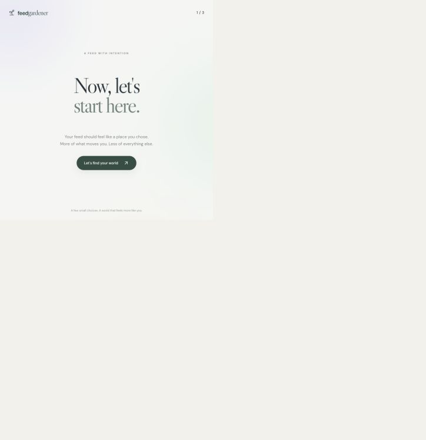

2. **Find the right interest area.** The world picker groups topics under broad areas such as Technology, Music, and Sports. Click **Technology** to reveal narrower groups, including **AI infrastructure** and **Developer tools**. Opening an area is navigation only; it does not select every topic in that area. Use the search field if the area you want is not visible.

   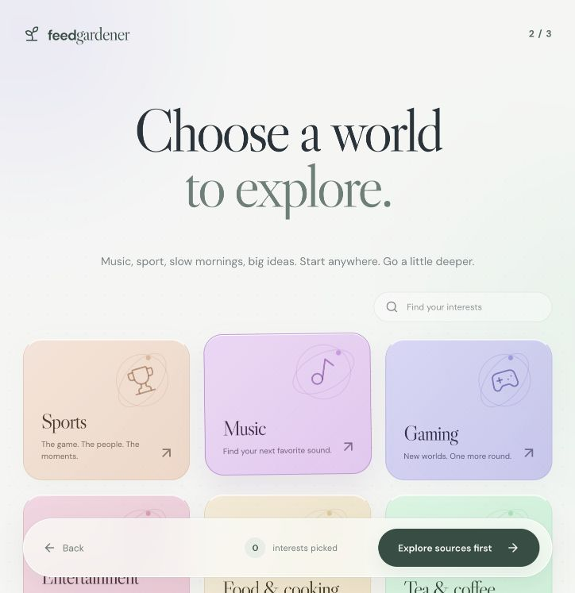 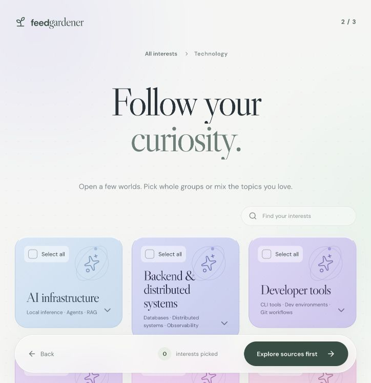

3. **Pick the topics that should guide the feed.** Expand **AI infrastructure** and select **Local inference** and **Agents** individually. A check mark appears on each selected card, and the footer changes to **2 interests picked**. The group-level **Select all** control would pick every topic in the group, which is broader than this example. These two selected tags become your saved interests and later help Feeder request and match public items. Click **Next: less of this** when the count and check marks are correct.

   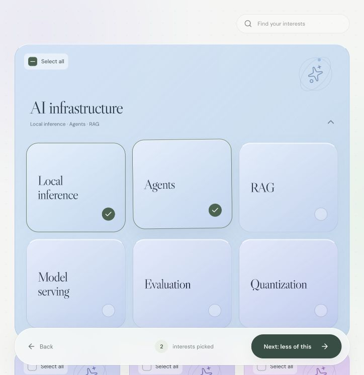

4. **Exclude an unwanted topic.** This screen is optional and has the opposite purpose from step 3: it blocks matching content. Type **Gaming** in the search box to find related topics, then select **Game reviews**. Confirm that the excluded-topic count in the footer changes to **1**, and click **Enter my feed**. Feeder saves the wanted and blocked tags together; it prevents the same tag from being both. An item tagged Game reviews is excluded even if it also matches Agents or Local inference. Skipping this screen would save no blocked topic.

   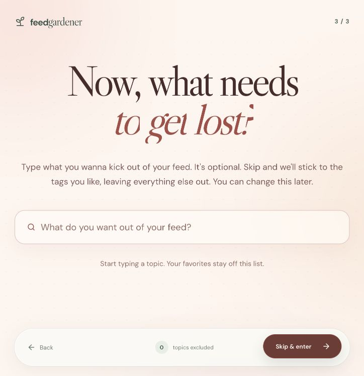 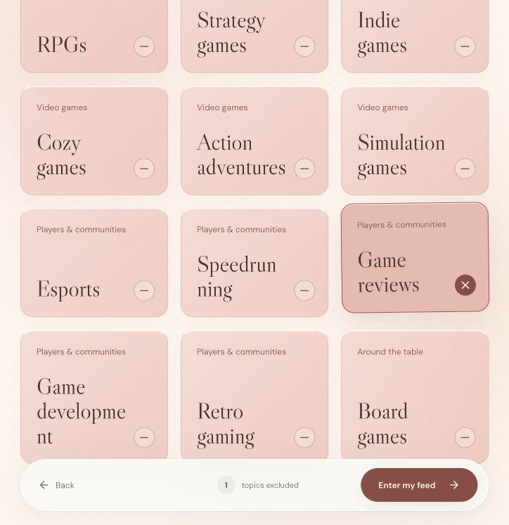

5. **Check the starting state in Discovery.** You arrive on **Discover → For you**. The **Your interests** panel should show AI infrastructure with the **Local inference** and **Agents** chips. **Manage interests** reopens the formal editor if you need to change them. The blank Jev average, **0 of 0 candidates scored**, and prompt to fetch mean no public candidates have been loaded in this view yet; a blank score here is not a scoring failure. Save this state so the effect of fetching is visible later.

   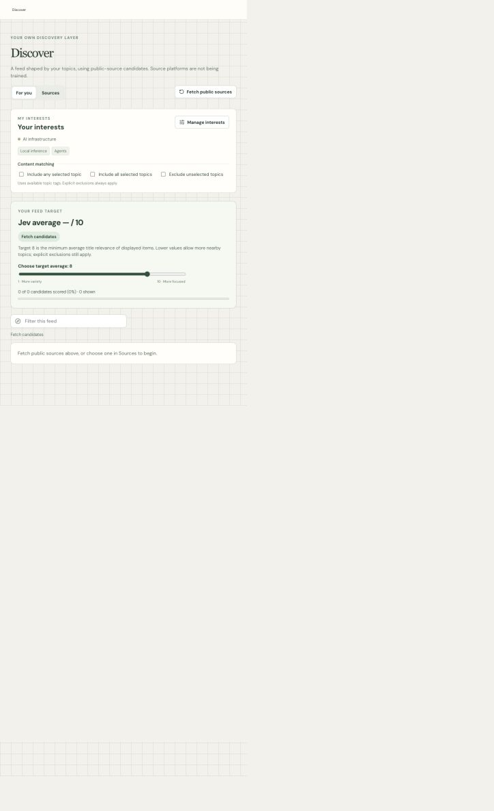

6. **Set matching rules and the Jev target.** Under **Content matching**, turn on **Include any selected topic**. With the tags from step 3, an item can pass if its available topic labels match Local inference **or** Agents. This control starts unchecked in this run because we added a blocked topic during setup. Leave the other controls off: **Include all selected topics** would require both selected tags on the same item; **Exclude unselected topics** would reject an item carrying any recognized topic you did not select. These switches can be combined, but stricter combinations can leave fewer or no matches. The Game reviews exclusion applies regardless of the switches.

   Next, move **Choose target average** from its default of **8** to **7**. This 1–10 control asks Feeder to assemble displayed items whose **average** Jev title-relevance score reaches at least 7; a single item can score below 7. A lower target can admit more nearby topics, while a higher target is more selective. Check the screenshot: **Include any selected topic** is checked, the target reads **7**, and the page still says **0 of 0 candidates scored**. Changing settings alone does not fetch items.

   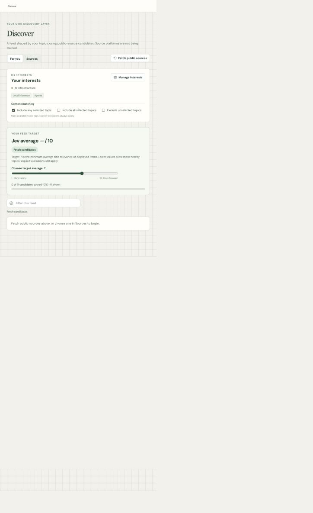

7. **Fetch public candidates and compare the result.** Click **Fetch public sources**. Feeder uses the selected topic labels as search hints for its available public sources, then normalizes, deduplicates, and applies your exclusions and matching rules. The button temporarily reads **Fetching…**. Wait until it reads **Refresh sources** and the Jev progress indicator finishes; otherwise you may be looking at an incomplete batch. This action reads public metadata into your local Feeder view and does not act on accounts at those source platforms. If a source fails, the page may show a warning while retaining items from sources that succeeded.

   Compare the screenshots below. In this run, **103 fetched items** was the broader public pool. After the selected-topic matching and prioritization, **30** were in the scoring batch. Jev returned scores for **30 of 30**; **22** had confidence below the feed's 70% threshold and were excluded from display. That left **8 shown**. Their average was **8.16/10**, so the page reported **Target reached** for the target of **7**. The average describes the eight displayed cards, not all 103 fetched items. Your counts may differ as public sources change.

   | Before fetch | After fetch |
   | --- | --- |
   |  | 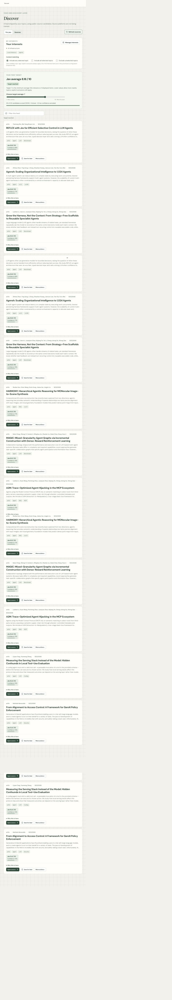 |

   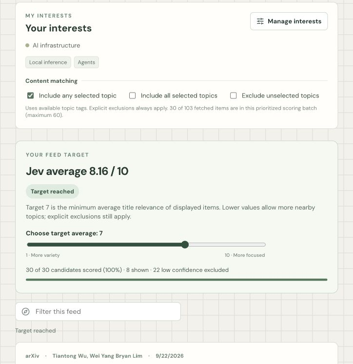

8. **Read a card and its explanation.** A result card shows the public source, title, topic labels, Jev score, and confidence. **Open source** takes you to the original item; **Save for later** keeps the item in Feeder. Expand **Why this is here** to see the signals used by Feeder. In the example, **Agents** matched a selected interest and the item was recently published. Jev evaluates title relevance; the number is Feeder's score, not a source-platform score or proof that the full article is useful.

   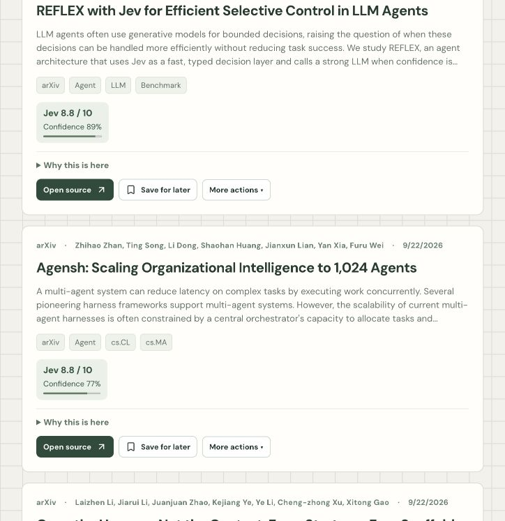 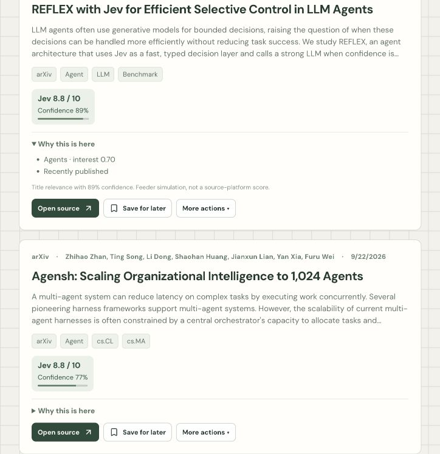

9. **Trace the source of the results.** Switch to **Discover → Sources**. The board totals count items ready under your current matching rules, so they are narrower than the 103-item fetched pool: this run showed **14** in **Research frontier**, **16** in **Open-source community**, and **0** in **Social radar**. Open **Research frontier**, then select **arXiv** to see that source's individual public items and links; selecting a source can trigger its own source-specific fetch. The social board stays empty here because no TikTok or X URL was imported and the optional Instagram and YouTube connections were not configured. Use these boards to inspect provenance and source status rather than treating a zero count as an invented result.

   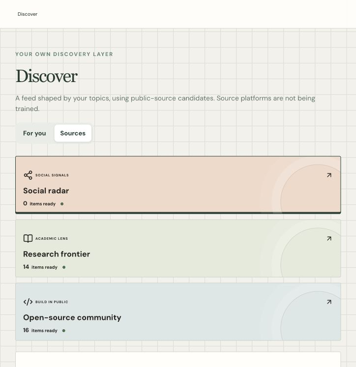 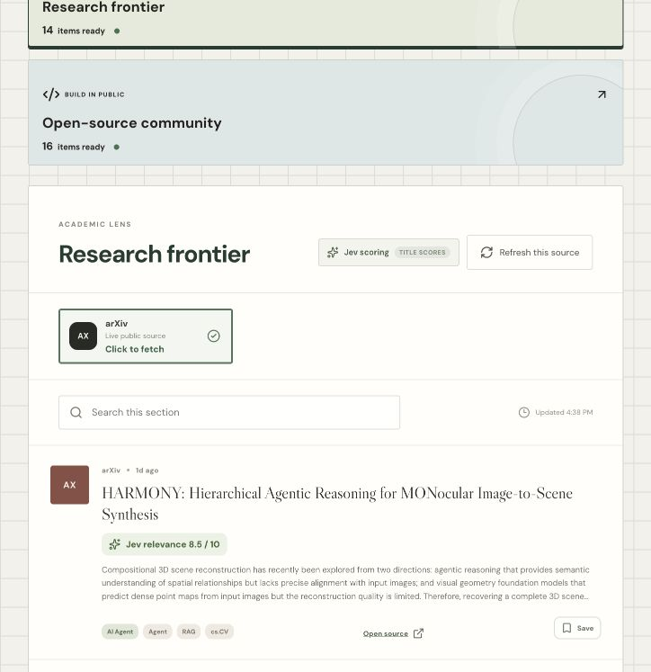

This walkthrough is a local UI run. It does not modify recommendations or activity on the source platforms. Browser preferences and feedback stay local; the CLI has separate state.

## Command line

The CLI uses the same domain logic and stores its data separately from the browser app.

```sh
pnpm cli -- help
```

## Project status

Feeder is a local prototype. arXiv, GitHub, and Hacker News collection, local preferences, title-based feed assembly, reversible feedback, saved items, and the resource library are implemented. YouTube search and Jev scoring require their respective API keys. Recommendation quality has not yet been validated with a real-user study.

Feeder does not read platform cookies, autoplay content, write likes or subscriptions, or claim to improve native recommendations on YouTube, TikTok, or other services.

## Documentation

- [Product goal and architecture](docs/feeder_product_goal.md)
- [API contract](docs/interface_contract.md)
- [Project structure](docs/project_structure.md)

## Development checks

```sh
pnpm typecheck
pnpm test
pnpm build
```
