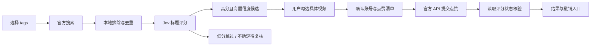

# YouTube 高相关候选与用户确认点赞（历史可选设计）

> 2026-09-21：此方案已被 [Feeder 产品目标](feeder_product_goal.md) 取代，不再是路线图或 MVP 需求。只读连接与既有 API 合同可以保留；本文不授权实现点赞、自动播放或原生 feed 调校。若未来另行启动独立实验，须重新核对平台政策、用户同意和当前接口。

日期：2026-09-21。状态：正反馈流程设计完成；只读 OAuth 连接已实现，缺少 Google 客户端配置，真实登录未验证。搜索、候选审核界面与账号写入尚未实现。此设计不构成平台合规认证，也不承诺原生推荐改善。

## 产品决定

用户选择兴趣后，程序通过 YouTube 官方接口搜索，Jev 只对标题与兴趣的相关度打分。程序筛出高分候选，用户审核并选择具体视频，确认后才由程序提交点赞。低分和未选内容不提交任何反馈。

本期只支持正反馈，不设计自动观看、自动 dislike 或“不感兴趣”请求。Get lost 中的排除项继续用于本产品候选过滤，不代表已经通知 YouTube。

## 页面与文案

沿用现有工作台侧栏，在 Garden 右侧增加独立的 YouTube 面板，与 simulator 明确区分。页面标题使用 `Find more of your thing`；不使用暗示效果已经实现的“已训练算法”。主界面保持简短，操作含义和限制放在现有 instructions 入口。

| 阶段 | 用户看到什么 | 主要操作 |
|---|---|---|
| 搜索 | 已选兴趣 chips、搜索条数、YouTube 来源 | `Find videos` |
| 评分 | 已完成数量和当前状态，可停止后续请求 | `Stop` |
| 审核 | 高分卡片；默认全部未勾选 | 勾选、`Open on YouTube`、`Review N likes` |
| 确认 | YouTube 账号/频道、具体视频标题和数量 | `Like these N videos on YouTube` / `Back` |
| 执行 | 每条进度、已完成与剩余数量 | `Stop remaining` |
| 结果 | 已核验、失败、待核验、未执行分别列出 | `Check status`、适用时 `Undo like` |

未接入时显示 `YouTube connection not available yet`，确认和写入按钮禁用。演示数据必须带 `Preview` 标记，不能显示真实成功回执。

卡片显示原始标题、频道、缩略图、来源链接及 `Title relevance 8.4/10`。相关度是对本次兴趣集合的评分，不编造“确实匹配某一个 tag”或模型未提供的推荐理由。搜索使用的 tag 可标为 `Search topic`。简短说明 `Title match only. You decide what to like.`；用户可主动打开视频，程序不自动播放。

候选可多选、取消及清空；不默认全选。确认面板按实际选中项生成固定清单，用户可以一次确认这份清单，不逐条弹窗。搜索刷新后新出现的视频不自动加入已确认清单。

## 筛选与状态规则

- 复用现有偏好 tags、blockedTags、onlySelectedTags 与英文目录名称。空兴趣时先选择兴趣；不使用无关热门视频补位。
- 首期建议单次搜索上限 20 条、单次提交上限 10 条，均为本产品可调整预算，不是平台公布的合规阈值。按 video ID 去重，不设置后台无限翻页或周期自动点赞。
- 暂沿用当前评分门槛：相关度 ≥7 且置信度 ≥0.70 才进入高分候选；≤3 跳过；其他分数、低置信度或评分缺失进入独立待复核区，不参与本轮点赞。阈值仍需标注数据校准。
- 明确命中的排除项优先剔除。现有 Jev 请求没有 blockedTags，标题与公开元数据也无法证明“没有排除内容”：保留用户审核，不能宣称完整语义过滤。onlySelectedTags 只约束候选相关度，不暗示可以排除 YouTube 原生 feed 的其他内容。
- Jev 仅返回分数与置信度。应用负责候选筛选，用户负责最终点赞选择；选了 tag 不等于选了所有未来视频。
- 不把 Jev 判断或程序执行自动写回用户偏好。记录模型建议、用户明确选择与执行器请求三个独立来源。

界面状态顺序为“未搜索 → 搜索中 → 评分中 → 待审核 → 待确认 → 提交中 → 完成/部分完成”。取消搜索不触发写入；停止执行只取消尚未发出的请求，已发出的请求必须核验，不能显示已撤销。

## 确认、执行与撤销

确认固定绑定当前 YouTube 身份、具体 video IDs、动作 like、偏好版本和清单版本。建议清单有效期 15 分钟，这是本产品保护措施。换账号、改偏好、修改清单或过期后必须重新审核；用户此前一次确认不授权未来候选。

提交前通过 `videos.getRating` 读取已有评分：

- 已为 like：标记 `Already liked`，不重发，也不提供“撤销本次点赞”。
- 已为 dislike：首期跳过并说明 `Previously disliked`，不覆盖用户已有负反馈。
- 为 none：允许进入本次新增点赞清单。
- 未知、unspecified 或读取失败：暂停该项，不猜测原状态。

执行前再次检查身份、清单有效性与已有状态，按有限队列逐项提交 `videos.rate(rating=like)`。一次用户确认可以对应多次 API 请求；这不等于 YouTube 提供原子批量点赞事务。

`204` 仅记录请求已接受；随后用 `videos.getRating` 验证账号评分为 like。分别记录“请求接受”和“状态核验”，不把超时标为失败或成功。核验未知时先读状态，不盲目重复写入。出现并发外部修改时不保证归因于本产品。

仅对本次原状态为 none、请求已接受且核验为 like 的条目提供撤销。撤销是用户另一次明确操作：先核对当前状态，再发送 `rating=none` 并核验。外部变化或结果不确定时停止自动撤销，保留提示；不尝试恢复 dislike。

OAuth 失效、身份变化或配额耗尽时停止队列，保留逐项结果；视频删除/禁用评分记录为该项失败。明确的临时拒绝可在原确认有效期内有限重试；网络超时等未知结果先核验。重新确认时只列出仍待执行的条目，不重跑成功项。

## 官方接口与授权边界

搜索计划使用 `search.list(type=video)`，使用项目自己的 API 凭据；点赞和状态查询使用用户授权的官方 OAuth 接口。OAuth scopes 必须来自实际所需接口，不能把允许的较宽 scope 描述成“只允许点赞”。权限、撤销连接、隐私说明和必要的平台审核需在启用真实账号写入前完成。

用户后续明确要求实现 Connect to YouTube；`instructionGoal.md` 已增加只读 OAuth 的狭窄例外。实现只请求 `youtube.readonly`，用于核验频道；access token 仅后端内存短时保存，密钥不进入模型、客户端持久化、CLI 导出或日志，不请求 offline access 或保存 refresh token。当前本地没有 Google OAuth 客户端配置，按钮显示实际配置步骤；配置后才会发起 Google 授权。点赞所需的增量权限留到写入功能实际实现时申请。

截至设计日，官方要求 YouTube 操作明确由用户发起并在执行前取得明确同意；本设计据此采用具体清单确认，不将 OAuth 本身当作点赞同意。该交互是设计选择，不能宣称平台已经审核批准。

官方说明 `videos.rate` 不影响视频的官方 like/dislike 计数；本项目只核验用户账号的评分状态。API 搜索结果也不等于用户私人首页。点赞提交或读取成功均不能证明原生推荐已改善。

## 现有接口复用与迁移计划

已检索 `lib/api-contract.ts`、全部 Route、`lib/candidate-decision.ts` 及测试、`lib/strategy.ts` 及测试、`lib/crawler/types.ts`、Garden 与 CLI 调用方。初次设计没有新增接口；后续只读连接新增的最少资源与回调已登记在 `interface_contract.md`，其余下表仍是未来计划。

| 现有能力 | 后续处理 |
|---|---|
| `harvestPublicSources` | 优先兼容增加显式 YouTube 来源与查询参数；不让旧调用自动发生 YouTube 搜索。当前 LiveSource 尚不含 YouTube，先统一来源类型与错误状态。 |
| `previewDecision` | 复用 Jev 评分逻辑。现有 watch_candidate 仍只表示观看候选，不重命名或静默解释成点赞。实现前拆清评分与动作策略，兼容旧调用方。 |
| 现有决策预算 | remainingMinuteBudget 是观看语义，不能伪造分钟数以通过点赞门禁；新增用途及动作预算前必须完成类型、校验与迁移设计。 |
| `createPlan` / `capabilities` | 复用计划、预算和能力读取；把搜索、评分、账号写入、核验分别描述。实现前保持 blocked_external。 |
| `previewEvaluation` | 仅用于将来真实原生 feed 样本比较；不把搜索结果、候选分数或点赞数量当推荐效果。 |
| 执行与授权 | 当前没有可复用的账号写入或 OAuth 合同，不能藏进 preview Route。实现前在接口合同中定义具体调用方、身份和清单绑定、结果状态、失败语义、版本与测试，再决定最少新增接口。 |

未来 Web 审核页与 CLI 共用领域合同。CLI 必须输出具体清单与账号后再交互确认；非交互调用只能使用已确认且有效的固定清单，不能仅凭 `--yes` 将未来动态搜索结果视为已同意。CLI 的 preferences 文件继续不保存平台 token。

## 实现顺序与验收

1. 先实现候选审核界面及清单状态，以明确标记的样例验证选择、取消、刷新和确认失效。
2. 接入官方搜索和现有 Jev 评分，验证去重、预算、排除规则及失败时不生成可执行清单。
3. 完成凭据边界与执行合同后接 OAuth、点赞和回读核验；在用户确认的真实视频上单独验证。
4. 最后验证撤销、停止、部分失败与重试；原生推荐效果保持独立的未验证状态。

必须覆盖：低分零写入；高分未选零写入；模型不可授权；确认后新视频不被带入；偏好/身份改变使确认失效；已有 like 不重复、已有 dislike 不覆盖；超时先查状态；停止不再发新请求；撤销不清除旧 like；凭据不进入日志或导出。UI 必须同时检查移动端、多选键盘操作与确认清单可读性。

## 官方依据

- [Search: list](https://developers.google.com/youtube/v3/docs/search/list)
- [Videos: rate](https://developers.google.com/youtube/v3/docs/videos/rate)
- [Videos: getRating](https://developers.google.com/youtube/v3/docs/videos/getRating)
- [YouTube Developer Policies](https://developers.google.com/youtube/terms/developer-policies)，重点 II.3、III.C.2、III.E.3。
